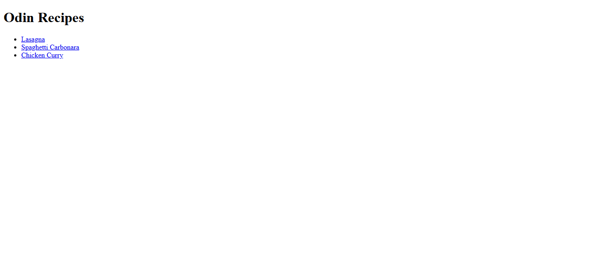
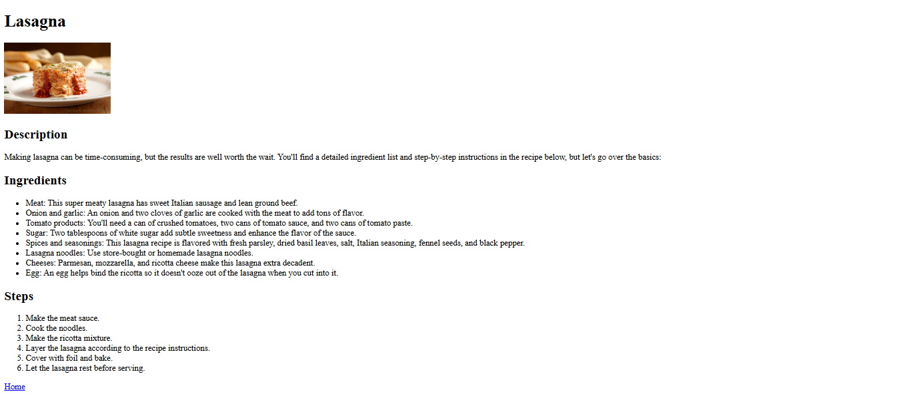

# Odin Recipes

**Live Demo:** [View Project Live](https://taimv2405.github.io/odin-project-solutions/foundations/odin-recipes/)

This is the [Odin Recipes](https://www.theodinproject.com/lessons/foundations-recipes) project built as part of the Foundations course in [The Odin Project](https://www.theodinproject.com/) curriculum.

The goal of this project is to demonstrate proficiency in basic HTML, including links, images, lists, and file structures.

## Skills Demonstrated

- **HTML Structure:** Using semantic tags like `<h1>`, `<ul>`, `<ol>`, `
`.
- **Links:** Working with absolute and relative paths to link pages together.
- **Images:** Embedding images correctly and organizing them in directories.
- **Lists:** Using ordered lists for steps and unordered lists for ingredients.
- **File Management:** Maintaining a clean project structure with separate folders for images and pages.

## Recipes

This website currently features the following recipes:
1. **Lasagna:** A classic meat and cheese lasagna.
2. **Spaghetti Carbonara:** A creamy, authentic Roman pasta dish.
3. **Chicken Curry:** A simple and flavorful curry with coconut milk.

## Screenshots

### Homepage

### Recipe Page Example

## Credits

- Project curriculum: [The Odin Project](https://www.theodinproject.com/)
- Image sources:
  - Lasagna: [Flickr](https://www.flickr.com/)
  - Spaghetti Carbonara: [CCNull](https://www.ccnull.de/)
  - Chicken Curry: [Pexels](https://www.pexels.com/)